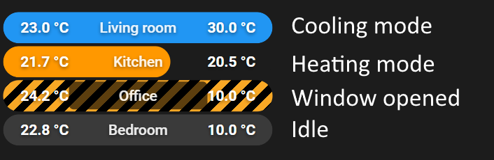
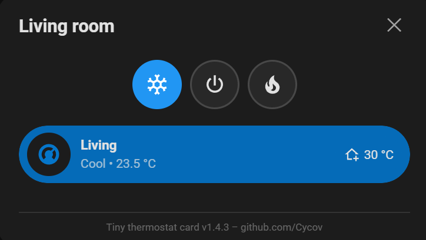

# Cycov Home Assistant

An aggregation repository that holds Home Assistant add-ons, HACS Lovelace cards, and custom components. Each sub-project is managed as a **git subtree** sourced from its own upstream GitHub repository. The latest release will be present here, for other commits for any particular addon or app, navigate to the corresponding repository

# Installation

## Apps

1. In Home Assistant, go to **Settings → Add-ons → Add-on Store → ⋮ → Repositories**
2. Add the repository URL: `https://github.com/Cycov/cycov-home-assistant`
3. That's it, now you should see the apps

## HACS
TBD

# App list

For now, it's only the [Typescript Automation Engine](https://github.com/Cycov/typescript-automation-engine) which allows to write and run Home Assistant automations in TypeScript with a managed runtime, built-in code editor, and real-time logging. More information and documentation about this addon can be found [here](https://github.com/Cycov/cycov-home-assistant/tree/main/addons/typescript-automation-engine)

# Cards

- [Energy Consumption Topology](https://github.com/Cycov/ha-energy-consumption-topology) - A Home Assistant Lovelace card that displays your energy consumption as a tree topology with animated power-flow bubbles.

- [Tiny thermostat card](https://github.com/Cycov/tiny-thermostat-card) - A compact Home Assistant Lovelace card that displays room temperature with heating/cooling control in a slim, slider-style bar. Also useful when using as thermostat for an AC and a separate radiator, instead of just one AC/HVAC for both heating and cooling.

The mode can be changed via a modal on double press. Has a space for custom card, in this screenshot a bubble card is present, but the default thermostat card can be placed:

